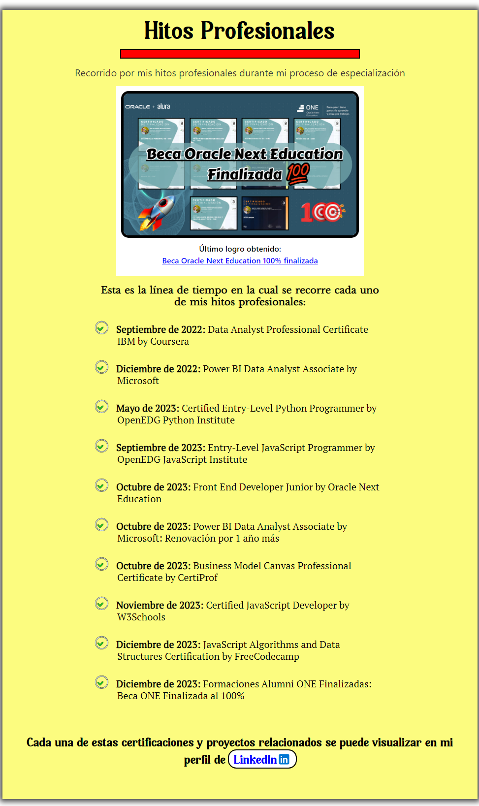

Este es el repositorio con el código del proyecto número dos llamado **Build a Tribute Page** para obtener la certificación Responsive Web Design de FreeCodecamp. Los requisitos del proyecto estan a continuación:

Me tomé la libertad de extender el proyecto más allá de los requisitos descritos. Mi proyecto consiste una página con los principales hitos profesionales conseguidos en mi proceso de especialización siendo el hito más reciente el haber finalizado la beca Oracle Next Education de manera completa al 100%: especialización Front End más formaciones Alumni. A continuación se puede visualizar el proyecto completo el cual es 100% responsivo:

